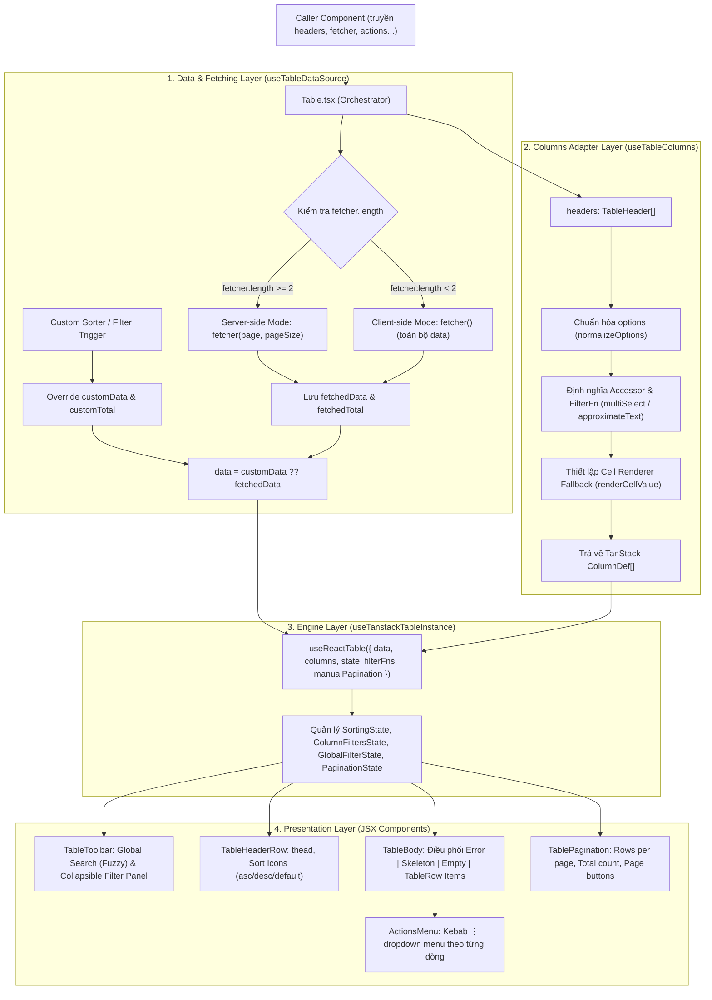

## Props

**Table có thể linh động xử lý data ở 2 mức là client và server tùy vào prop truyền vào**:

| Chế độ                      | Khi nào chạy NỘI BỘ (Client-side)                                   | Khi nào dùng API (Server-side)                                                          |
| :-------------------------- | :------------------------------------------------------------------ | :-------------------------------------------------------------------------------------- |
| **Lọc dữ liệu (Filter)**    | **KHÔNG** truyền prop `filter`<br>_(Hoặc `filter = undefined`)_     | **CÓ** truyền prop `filter`<br>`<Table filter={async (attr, val, toDate) => ...} />`    |
| **Sắp xếp (Sort)**          | **KHÔNG** truyền prop `sorter`<br>_(Hoặc `sorter = undefined`)_     | **CÓ** truyền prop `sorter`<br>`<Table sorter={async (attr, order) => ...} />`          |
| **Phân trang (Pagination)** | Hàm `fetcher` khai báo **dưới 2 tham số**:<br>`fetcher={() => ...}` | Hàm `fetcher` khai báo **từ 2 tham số trở lên**:<br>`fetcher={(page, pageSize) => ...}` |

**Table chỉ re-render / fetch lại khi**:

- User thay đổi giá trị filter.
- User sort.
- User click vào các nút phân trang.

### `TableProps<T>` (Props cấp Component)

| Prop                 | Kiểu dữ liệu                                                  | Mặc định                     | Bắt buộc | Mô tả & Ý nghĩa                                                                                                                                                                        |
| :------------------- | :------------------------------------------------------------ | :--------------------------- | :------: | :------------------------------------------------------------------------------------------------------------------------------------------------------------------------------------- |
| `headers`            | `TableHeader<T>[]`                                            | —                            |  **Có**  | Danh sách cấu hình các cột trong bảng (xem chi tiết mục `TableHeader<T>`).                                                                                                             |
| `fetcher`            | `TableFetcher<T>`                                             | —                            |  **Có**  | Hàm cung cấp dữ liệu cho bảng. Tự động nhận diện Client-side hoặc Server-side pagination qua số lượng tham số (arity).                                                                 |
| `sorter`             | `(attr, order) => TableCustomResult<T> \| Promise<...>`       | `undefined`                  |  Không   | Callback khi người dùng click sort cột. Dùng khi muốn can thiệp server-side sorting hoặc custom sorting logic ngoài TanStack.                                                          |
| `filter`             | `(attr, val, toDate) => TableCustomResult<T> \| Promise<...>` | `undefined`                  |  Không   | Callback khi submit filter cột hoặc global search. Đối với cột có `isDuration: true`, hàm nhận `(attr, fromDate, toDate)`. Cho phép gọi API lọc từ server hoặc override data thủ công. |
| `onClickRow`         | `(row: T) => void`                                            | `undefined`                  |  Không   | Handler khi người dùng click hoặc nhấn `Enter`/`Space` vào 1 dòng. Khi được truyền, dòng sẽ có hiệu ứng hover & con trỏ `pointer`.                                                     |
| `actions`            | `TableAction<T>[]`                                            | `undefined`                  |  Không   | Danh sách các hành động trên từng dòng (hiển thị dưới dạng menu kebab `⋮` ở cột cuối cùng).                                                                                            |
| `loading`            | `boolean`                                                     | `false`                      |  Không   | Ép trạng thái loading từ component cha (kết hợp với `fetchLoading` nội bộ để hiện Skeleton).                                                                                           |
| `loadingMessage`     | `string`                                                      | `t.common.loading`           |  Không   | Thông báo cho trình đọc màn hình (accessibility - `aria-live`/`status`) khi đang tải dữ liệu.                                                                                          |
| `emptyMessage`       | `string`                                                      | `t.common.noData`            |  Không   | Nội dung hiển thị khi bảng không có dữ liệu (`rows.length === 0`).                                                                                                                     |
| `configErrorMessage` | `string`                                                      | `t.table.configErrorMessage` |  Không   | Thông báo lỗi hiển thị trên Card cảnh báo nếu runtime phát hiện `fetcher` không phải là một hàm hợp lệ.                                                                                |
| `pageSizeOptions`    | `number[]`                                                    | `[10, 20, 50, 100, 200]`     |  Không   | Danh sách các tùy chọn số dòng trên 1 trang trong dropdown phân trang.                                                                                                                 |
| `defaultPageSize`    | `number`                                                      | `10`                         |  Không   | Số lượng dòng hiển thị mặc định trên mỗi trang khi khởi tạo.                                                                                                                           |
| `stickyHeader`       | `boolean`                                                     | `true`                       |  Không   | Ghim cố định thanh tiêu đề `<thead>` ở trên cùng khi cuộn bảng theo chiều dọc (`sticky top-0 z-10`).                                                                                   |
| `className`          | `string`                                                      | `""`                         |  Không   | Class CSS tùy biến bổ sung cho thẻ `<div>` bao ngoài toàn bộ Table component.                                                                                                          |
| `showGlobalSearch`   | `boolean`                                                     | `true`                       |  Không   | Bật/tắt thanh tìm kiếm nhanh toàn cục (Global Fuzzy Search) ở Toolbar.                                                                                                                 |
| `showPagination`     | `boolean`                                                     | `true`                       |  Không   | Bật/tắt thanh phân trang (Pagination bar) ở dưới chân bảng.                                                                                                                            |
| `keyExtractor`       | `(row: T, index: number) => string \| number`                 | `undefined`                  |  Không   | Hàm trích xuất ID định danh duy nhất cho mỗi dòng (kết nối trực tiếp vào `getRowId` của TanStack Table).                                                                               |
| `entityName`         | `string`                                                      | `t.table.row`                |  Không   | Tên thực thể hiển thị trong placeholder ô tìm kiếm ("Tìm kiếm {entityName}...") và tổng số bản ghi ("Tổng N {entityName}").                                                            |
| `tableOptions`       | `Partial<TableOptions<T>>`                                    | `undefined`                  |  Không   | **Escape Hatch**: Cho phép ghi đè hoặc bổ sung bất kỳ cấu hình nâng cao nào vào trực tiếp `useReactTable()`.                                                                           |

---

### `TableHeader<T>` (Cấu hình Cột)

| Thuộc tính        | Kiểu dữ liệu                               | Mặc định    | Mô tả & Ý nghĩa                                                                                                                                                                                                                                                 |
| :---------------- | :----------------------------------------- | :---------- | :-------------------------------------------------------------------------------------------------------------------------------------------------------------------------------------------------------------------------------------------------------------- |
| `name`            | `string`                                   | _Bắt buộc_  | Tiêu đề hiển thị của cột trên thẻ `<th>`.                                                                                                                                                                                                                       |
| `id`              | `string`                                   | Tự sinh     | ID duy nhất định danh cột trong TanStack (mặc định lấy theo `accessorKey`, `mapTo` hoặc `col_{index}`).                                                                                                                                                         |
| `icon`            | `ReactNode`                                | `undefined` | Icon nhỏ hiển thị bên trái tiêu đề cột trong thẻ `<th>`.                                                                                                                                                                                                        |
| `accessorKey`     | `keyof T & string`                         | `undefined` | Tên thuộc tính trong đối tượng `row` dùng để đọc giá trị, sắp xếp và lọc dữ liệu.                                                                                                                                                                               |
| `accessorFn`      | `(row: T) => unknown`                      | `undefined` | Hàm tính toán/trích xuất giá trị ô (dùng khi dữ liệu phức tạp, lồng nhau hoặc ghép chuỗi từ nhiều trường).                                                                                                                                                      |
| `mapTo`           | `keyof T & string`                         | `undefined` | **Phân tách Sorting vs Display**: Tên thuộc tính dùng để hiển thị trên UI khi thuộc tính dùng để sort/filter khác với thuộc tính hiển thị (ví dụ: sort bằng `statusCode` nhưng hiển thị bằng `statusName`).                                                     |
| `cell`            | `(value, row, index) => ReactNode`         | `undefined` | Hàm render toàn quyền nội dung ô `<td>`. Nhận vào giá trị thô `value`, toàn bộ object `row` và chỉ số `index`.                                                                                                                                                  |
| `render`          | `(row: T) => renderComponent \| ReactNode` | `undefined` | Factory bọc giá trị: Trả về một Component/tag (như `"strong"`, `"span"`, `Badge`) để bọc giá trị thô làm `children`, hoặc trả về một React element hoàn chỉnh.                                                                                                  |
| `values`          | `(FilterOption \| string \| number)[]`     | `undefined` | Tập hợp các giá trị cố định của cột. Khi có thuộc tính này, bộ lọc của cột sẽ tự động chuyển từ ô nhập text sang dạng **Dropdown Checkbox đa lựa chọn**.                                                                                                        |
| `valueLabels`     | `string[]`                                 | `undefined` | Nhãn hiển thị tương ứng theo vị trí index của mảng `values` trong menu lọc.                                                                                                                                                                                     |
| `allowSort`       | `boolean`                                  | `false`     | Bật hoặc tắt tính năng sắp xếp (Sort) trên cột này (mặc định: `false`).                                                                                                                                                                                         |
| `showFilter`      | `boolean`                                  | `false`     | Bật hoặc ẩn cột này khỏi panel bộ lọc mở rộng ở Toolbar (mặc định: `false`).                                                                                                                                                                                    |
| `isDuration`      | `boolean`                                  | `false`     | Kích hoạt bộ lọc khoảng thời gian/ngày (Date Range). Khi `isDuration = true` và `showFilter = true`, panel filter sẽ hiển thị 2 ô datepicker hiển thị theo định dạng trực quan **`dd/mm/yyyy`** (hỗ trợ cả nhập text lẫn chọn lịch popup); khi submit, callback `filter` của bảng sẽ nhận 2 tham số là `(attribute, fromDate, toDate)` đã được các helper tự động chuẩn hóa sang định dạng **ISO 8601 UTC** (Start of Day `...T00:00:00.000Z` và End of Day `...T23:59:59.999Z`) tương thích hoàn toàn với PostgreSQL `timestamptz`. |
| `width`           | `number \| string`                         | `undefined` | Độ rộng cố định của cột (hỗ trợ pixel `150` hoặc chuỗi CSS `"20%"`).                                                                                                                                                                                            |
| `headerClassName` | `string`                                   | `undefined` | Custom class CSS cho ô tiêu đề `<th>` của cột.                                                                                                                                                                                                                  |
| `cellClassName`   | `string`                                   | `undefined` | Custom class CSS cho các ô dữ liệu `<td>` thuộc cột này.                                                                                                                                                                                                        |

---

### `TableAction<T>` (Cấu hình Row Action Menu)

| Thuộc tính | Kiểu dữ liệu          | Bắt buộc | Mô tả & Ý nghĩa                                                                         |
| :--------- | :-------------------- | :------: | :-------------------------------------------------------------------------------------- |
| `label`    | `string`              |  **Có**  | Nhãn văn bản hiển thị cho hành động trong dropdown menu.                                |
| `icon`     | `ReactNode`           |  Không   | Icon hiển thị bên cạnh nhãn hành động (ví dụ: `Edit`, `Trash2`, `Eye`).                 |
| `handler`  | `(row: T) => void`    |  Không   | Hàm callback thực thi khi người dùng click vào hành động, nhận dữ liệu dòng `row`.      |
| `hidden`   | `(row: T) => boolean` |  Không   | Hàm điều kiện ẩn/hiện hành động động theo từng dòng dữ liệu cụ thể.                     |
| `danger`   | `boolean`             |  Không   | Đánh dấu hành động nguy hiểm (sẽ hiển thị màu đỏ cảnh báo, ví dụ: Xóa, Khóa tài khoản). |

---

### `TableFetcher<T>` & `TableFetcherResult<T>`

```ts
export interface TableFetcherResult<T> {
  data: T[] // Danh sách các bản ghi của trang hiện tại (hoặc toàn bộ dataset)
  total: number // Tổng số bản ghi (bắt buộc khi dùng Server-side Pagination)
}

export type TableFetcher<T> = (
  page?: number,
  pageSize?: number,
) => Promise<TableFetcherResult<T>> | TableFetcherResult<T>
```

---

## Flow


