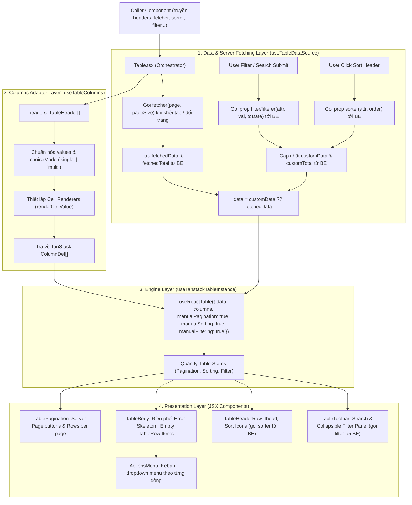

## Kiến trúc Server-Side (100% Backend-Driven)

**Table hoạt động hoàn toàn ở chế độ Server-Side (dựa vào Backend)**:
- **Phân trang (Pagination)**: Dữ liệu được tải theo từng trang thông qua hàm `fetcher(page, pageSize)`. Table không lưu trữ hay cắt lát (slice) toàn bộ dataset trên client.
- **Lọc dữ liệu (Filter)**: Khi người dùng tìm kiếm toàn cục (Global Search) hoặc chọn bộ lọc cột (Dropdown/Date range/Text), Table gọi callback `filter` (hoặc `filterer`) truyền tham số xuống Backend để lấy dữ liệu đã lọc.
- **Sắp xếp (Sort)**: Khi người dùng click vào tiêu đề cột có `allowSort: true`, Table gọi callback `sorter(attribute, sortOrder)` truyền tiêu chí sắp xếp xuống Backend.

**Table chỉ re-render / fetch lại dữ liệu khi**:
- Người dùng thay đổi giá trị filter hoặc submit tìm kiếm.
- Người dùng click đổi thứ tự sắp xếp cột (Sort).
- Người dùng chuyển trang hoặc thay đổi số bản ghi trên mỗi trang (Page size).

---

### `TableProps<T>` (Props cấp Component)

| Prop              | Kiểu dữ liệu                                                  | Mặc định                 | Bắt buộc | Mô tả & Ý nghĩa                                                                                                                                                                        |
| :---------------- | :------------------------------------------------------------ | :----------------------- | :------: | :------------------------------------------------------------------------------------------------------------------------------------------------------------------------------------- |
| `headers`         | `TableHeader<T>[]`                                            | —                        |  **Có**  | Danh sách cấu hình các cột trong bảng (xem chi tiết mục `TableHeader<T>`).                                                                                                             |
| `fetcher`         | `TableFetcher<T>`                                             | —                        |  **Có**  | Hàm tải dữ liệu phân trang từ Backend: `(page, pageSize) => Promise<{ data, total }>`.                                                                                                 |
| `sorter`          | `(attr, order) => TableCustomResult<T> \| Promise<...>`       | `undefined`              |  Không   | Callback gọi API sắp xếp từ Server khi người dùng click sort trên các cột có `allowSort: true`.                                                                                         |
| `filter`          | `(attr, val, toDate) => TableCustomResult<T> \| Promise<...>` | `undefined`              |  Không   | Callback gọi API lọc dữ liệu từ Server khi người dùng filter cột hoặc tìm kiếm. Đối với cột ngày (`isDuration`), callback nhận `(attr, fromDate, toDate)` theo định dạng ISO 8601.     |
| `filterer`        | `(attr, val, toDate) => TableCustomResult<T> \| Promise<...>` | `undefined`              |  Không   | Alias tương đương với prop `filter`.                                                                                                                                                   |
| `choiceMode`      | `"single" \| "multi"`                                         | `"multi"`                |  Không   | Chế độ chọn mặc định cho các bộ lọc danh sách cố định (`values`). `"single"`: chỉ chọn được 1 giá trị duy nhất; `"multi"`: được chọn nhiều giá trị cùng lúc (mặc định).              |
| `onClickRow`      | `(row: T) => void`                                            | `undefined`              |  Không   | Handler khi người dùng click hoặc nhấn `Enter`/`Space` vào 1 dòng. Khi được truyền, dòng sẽ có hiệu ứng hover & con trỏ `pointer`.                                                     |
| `actions`         | `TableAction<T>[]`                                            | `undefined`              |  Không   | Danh sách các hành động trên từng dòng (hiển thị dưới dạng menu kebab `⋮` ở cột cuối cùng).                                                                                            |
| `loading`         | `boolean`                                                     | `false`                  |  Không   | Ép trạng thái loading từ component cha (kết hợp với `fetchLoading` nội bộ để hiện Skeleton).                                                                                           |
| `emptyMessage`    | `string`                                                      | `t.common.noData`        |  Không   | Nội dung hiển thị tùy biến khi bảng không có dữ liệu. Nếu không truyền, bảng tự động hiển thị theo đa ngôn ngữ.                                                                        |
| `pageSizeOptions` | `number[]`                                                    | `[10, 20, 50, 100, 200]` |  Không   | Danh sách các tùy chọn số dòng trên 1 trang trong dropdown phân trang.                                                                                                                 |
| `defaultPageSize` | `number`                                                      | `10`                     |  Không   | Số lượng dòng hiển thị mặc định trên mỗi trang khi khởi tạo.                                                                                                                           |
| `stickyHeader`    | `boolean`                                                     | `true`                   |  Không   | Ghim cố định thanh tiêu đề `<thead>` ở trên cùng khi cuộn bảng theo chiều dọc (`sticky top-0 z-10`).                                                                                   |
| `className`       | `string`                                                      | `""`                     |  Không   | Class CSS tùy biến bổ sung cho thẻ `<div>` bao ngoài toàn bộ Table component.                                                                                                          |
| `showGlobalSearch`| `boolean`                                                     | `true`                   |  Không   | Bật/tắt thanh tìm kiếm nhanh toàn cục ở Toolbar.                                                                                                                                       |
| `showPagination`  | `boolean`                                                     | `true`                   |  Không   | Bật/tắt thanh phân trang (Pagination bar) ở dưới chân bảng.                                                                                                                            |
| `keyExtractor`    | `(row: T, index: number) => string \| number`                 | `undefined`              |  Không   | Hàm trích xuất ID định danh duy nhất cho mỗi dòng (kết nối trực tiếp vào `getRowId` của TanStack Table).                                                                               |
| `entityName`      | `string`                                                      | `t.table.row`            |  Không   | Tên thực thể hiển thị trong placeholder ô tìm kiếm ("Tìm kiếm {entityName}...") và tổng số bản ghi ("Tổng N {entityName}").                                                            |
| `tableOptions`    | `Partial<TableOptions<T>>`                                    | `undefined`              |  Không   | **Escape Hatch**: Cho phép ghi đè hoặc bổ sung bất kỳ cấu hình nâng cao nào vào trực tiếp `useReactTable()`.                                                                           |

### Cơ Chế Render Thông Báo Tự Động (i18n)

Table tự động render các thông báo và hỗ trợ đa ngôn ngữ thông qua `useLanguage()`:

1. **Không có dữ liệu (Empty State)**:
   - Xuất hiện khi danh sách dữ liệu rỗng (`rows.length === 0`) **hoặc** khi API trả về mã lỗi `404` (Not Found).
   - Hiển thị icon `Inbox` và nội dung thông báo (`t.common.noData` - "Không có dữ liệu" / `emptyMessage`).
2. **Đã có lỗi xảy ra (Error State)**:
   - Xuất hiện khi API Backend gặp sự cố khác (mã 500, lỗi mạng, lỗi máy chủ...).
   - Hiển thị icon `AlertCircle` cảnh báo màu đỏ, tiêu đề `t.table.error` ("Đã có lỗi xảy ra") và thông tin lỗi `t.table.errorDesc`.
3. **Lỗi cấu hình bảng (Config Error)**:
   - Tự động hiển thị `t.table.configError` và `t.table.configErrorMessage` khi `fetcher` không hợp lệ.
4. **Trạng thái đang tải (Loading Status)**:
   - Tự động cập nhật `t.common.loading` cho trình đọc màn hình (`aria-live="status"`).

---

### `TableHeader<T>` (Cấu hình Cột)

| Thuộc tính        | Kiểu dữ liệu                               | Mặc định    | Mô tả & Ý nghĩa                                                                                                                                                                                                                                                 |
| :---------------- | :----------------------------------------- | :---------- | :-------------------------------------------------------------------------------------------------------------------------------------------------------------------------------------------------------------------------------------------------------------- |
| `name`            | `string`                                   | _Bắt buộc_  | Tiêu đề hiển thị của cột trên thẻ `<th>`.                                                                                                                                                                                                                       |
| `id`              | `string`                                   | Tự sinh     | ID duy nhất định danh cột trong TanStack (mặc định lấy theo `accessorKey`, `mapTo` hoặc `col_{index}`).                                                                                                                                                         |
| `icon`            | `ReactNode`                                | `undefined` | Icon nhỏ hiển thị bên trái tiêu đề cột trong thẻ `<th>`.                                                                                                                                                                                                        |
| `accessorKey`     | `keyof T & string`                         | `undefined` | Tên thuộc tính trong đối tượng `row` dùng để đọc giá trị hiển thị.                                                                                                                                                                                               |
| `accessorFn`      | `(row: T) => unknown`                      | `undefined` | Hàm tính toán/trích xuất giá trị ô (dùng khi dữ liệu phức tạp, lồng nhau hoặc ghép chuỗi từ nhiều trường).                                                                                                                                                      |
| `mapTo`           | `keyof T & string`                         | `undefined` | Tên thuộc tính dùng để hiển thị trên UI khi thuộc tính dùng để sort/filter khác với thuộc tính hiển thị (ví dụ: filter bằng `statusCode` nhưng hiển thị bằng `statusName`).                                                                                   |
| `cell`            | `(value, row, index) => ReactNode`         | `undefined` | Hàm render toàn quyền nội dung ô `<td>`. Nhận vào giá trị thô `value`, toàn bộ object `row` và chỉ số `index`.                                                                                                                                                  |
| `render`          | `(row: T) => renderComponent \| ReactNode` | `undefined` | Factory bọc giá trị: Trả về một Component/tag (như `"strong"`, `"span"`, `Badge`) để bọc giá trị thô làm `children`, hoặc trả về một React element hoàn chỉnh.                                                                                                  |
| `values`          | `(FilterOption \| string \| number)[]`     | `undefined` | Tập hợp các giá trị cố định của cột. Khi có thuộc tính này, bộ lọc của cột sẽ tự động chuyển từ ô nhập text sang dạng **Nút chọn giá trị (Single hoặc Multi-Select tùy theo `choiceMode`)**.                                                                   |
| `choiceMode`      | `"single" \| "multi"`                      | `undefined` (kế thừa từ `TableProps`, mặc định `"multi"`) | Chế độ chọn giá trị của bộ lọc trên cột này. `"single"`: chỉ được chọn 1 giá trị; `"multi"`: được chọn nhiều giá trị cùng lúc. Nếu được khai báo, sẽ ghi đè lên `choiceMode` của `TableProps`.                                                           |
| `valueLabels`     | `string[]`                                 | `undefined` | Nhãn hiển thị tương ứng theo vị trí index của mảng `values` trong menu lọc.                                                                                                                                                                                     |
| `allowSort`       | `boolean`                                  | `false`     | Bật hoặc tắt tính năng sắp xếp (Sort) trên cột này. Khi click sẽ kích hoạt callback `sorter` để gọi Server.                                                                                                                                                    |
| `showFilter`      | `boolean`                                  | `false`     | Bật hoặc ẩn cột này khỏi panel bộ lọc mở rộng ở Toolbar. Khi submit sẽ kích hoạt callback `filter`/`filterer` để gọi Server.                                                                                                                                  |
| `isDuration`      | `boolean`                                  | `false`     | Kích hoạt bộ lọc khoảng thời gian/ngày (Date Range). Khi `isDuration = true` và `showFilter = true`, panel filter sẽ hiển thị 2 ô datepicker định dạng **`dd/mm/yyyy`**; khi submit, callback `filter` của bảng sẽ nhận `(attribute, fromDate, toDate)` đã được chuẩn hóa sang **ISO 8601 UTC** tương thích hoàn toàn với PostgreSQL `timestamptz`. |
| `width`           | `number \| string`                         | `undefined` | Độ rộng cố định của cột (hỗ trợ pixel `150` hoặc chuỗi CSS `"20%"`).                                                                                                                                                                                            |
| `headerClassName` | `string`                                   | `undefined` | Custom class CSS cho ô tiêu đề `<th>` của cột.                                                                                                                                                                                                                  |
| `cellClassName`   | `string`                                   | `undefined` | Custom class CSS cho các ô dữ liệu `<td>` thuộc cột này.                                                                                                                                                                                                        |

---

### `TableAction<T>` (Cấu hình Row Action Menu)

| Thuộc tính | Kiểu dữ liệu          | Bắt buộc | Mô tả & Ý nghĩa                                                                         |
| :--------- | :-------------------- | :------: | :-------------------------------------------------------------------------------------- |
| `label`    | `string`              |  **Có**  | Nhãn văn bản hiển thị cho hành động trong dropdown menu.                                |
| `icon`     | `ReactNode`           |  Không   | Icon hiển thị bên cạnh nhãn hành động (ví dụ: `Edit`, `Trash2`, `Eye`).                 |
| `handler`  | `(row: T) => void`    |  Không   | Hàm callback thực thi khi người dùng click vào hành động, nhận dữ liệu dòng `row`.      |
| `hidden`   | `(row: T) => boolean` |  Không   | Hàm điều kiện ẩn/hiện hành động động theo từng dòng dữ liệu cụ thể.                     |
| `danger`   | `boolean`             |  Không   | Đánh dấu hành động nguy hiểm (sẽ hiển thị màu đỏ cảnh báo, ví dụ: Xóa, Khóa tài khoản). |

---

### `TableFetcher<T>` & `TableFetcherResult<T>`

```ts
export interface TableFetcherResult<T> {
  data: T[] // Danh sách các bản ghi của trang hiện tại từ BE
  total: number // Tổng số bản ghi từ BE (dùng để tính toán số trang phân trang)
}

export type TableFetcher<T> = (
  page: number,
  pageSize: number,
) => Promise<TableFetcherResult<T>> | TableFetcherResult<T>
```

---

## Flow Hoạt Động (Server-Side)


